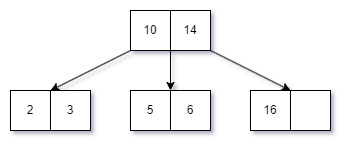
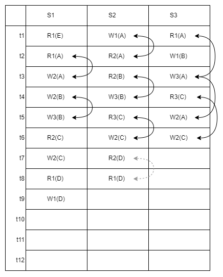
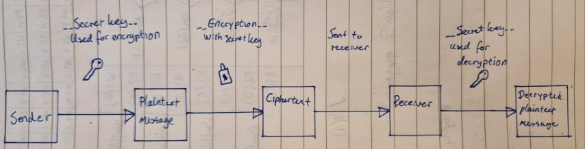
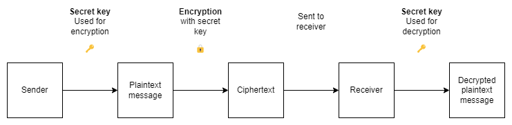
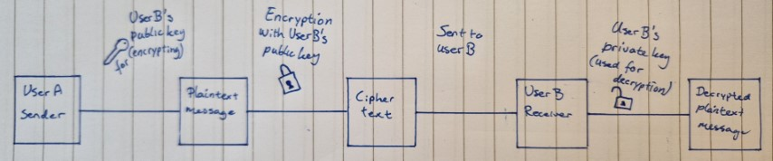
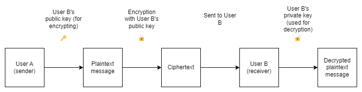

> Source of exam paper:
> University of South-Eastern Norway. (2022). DAT2000-1, winter 2022. Business School. https://usn.instructure.com/courses/31849/files/3517109?module_item_id=571344 (Authentication needed to access)

The following is my answer to the exam. I do not know if the answers are right or good. Use on your own risk. This is to be considered practice. I have copied the questions from the exam as sourced in the quotation.

---


| Subject code: DAT2000-1 | Subject name: Databases 2 | |
| --- | --- | --- |
| Examination date: 19/12/2022 | Examination time from/to 9:00 - 13:00 | Total hours: 4 |
| Resonsible course manager: Ali Chelli | | |
| Campus: Ringerike | Faculty: Business School |
| No. of assignments: 5 | No. of attachments: 0 | No. of pages incl. front page and attachments: 4 |
| Permitted aids: none | | 
| Information regarding attachments: | |
| Comments: | |
| Select the type of examination paper: | Spreadsheets [ ] | Line sheets [x] |


#### __Problem 1__
We consider a hash file organization. The hash function determines the bucket number in which a record must be placed. The considered hash function H computes the remainder of the division of the record_ID by 4. The hash function H is defined as 
H(record_ID) = record_ID % 4

We call "bucket 0", the bucket where we place the records for which H(record_ID) = 0.
- [x] 1. Determine the total number of buckets  
    Four buckets

- [x] 2. Other than the "bucket 0", there are other buckets. Provide the name of those other buckets.  
	Bucket 1, bucket 2, bucket 3

- [x] 3. Consider the records with the record_ID values of 1, 2, 3, 4,  5, 6, 7, 8. Place these records in the corresponding buckets according to the hash function H.  
	 H(1) = 1 % 4 = 1  
	 H(2) = 2 % 4 = 2  
	 H(3) = 3 % 4 = 3  
	 H(4) = 4 % 4 = 0  
	 H(5) = 5 % 4 = 1  
	 H(6) = 6 % 4 = 2  
	 H(7) = 7 % 4 = 3  
	 H(8) = 8 % 4 = 0  
	 


#### __Problem 2__
We consider the following B+-tree called "Tree 0".
 
- [x] _1. For this B+-tree, what is the maximum number of keys per node?_
	 Two. m-1. The root node has two keys and three children. This suggests the B+-tree has an order of 3, where each node can have up to two keys and three children.

- [x] _2. For this B+-tree, what is the maximum number of children per node?_
	Three. The root node has two keys, `5` and `10`. A node with two keys can have up to three children because the keys divide the data into three ranges: 
	- 1. Values less than `5` (left child)
	- 2. Values between `5` and `10` (middle child)
	- 3. Values greater than `10` (right child). 
	Since the root node has three child nodes belonging to these three ranges, the maximum number of children per node in this B+-tree is three.

- [x] _3. For this B+-tree, what is the order M of the three?_
	Order M: 3 (maximum number of children per node: 3)

- [x]  _4. Insert the value 3 in Tree 0 and draw the resulting tree. We call the resulting tree "Tree 1"._
	

- [ ] _5. Insert the value 7 in Tree 1 and draw the resulting tree. We call the resulting tree "Tree 2"._


_6. Insert the value 4 in Tree 2 and draw the resulting tree. We call the resulting tree "Tree 3"._


#### __Problem 3__
- [x] 1. Provide the name and definition of the ACID properties  
	- A: Atomicity
		The "_all or nothing property_". Making sure the transaction is either performed fully or not at all (Connoly & Begg, 2015, p. 671)  
	
	- C: Consistency
		Making sure that transactions are consistent. Such as when transferring money to one account to another, one must make sure that the amount gained on the one account equals the amount lost on the other account (Connoly & Begg, 2015, p. 671)  
	
	- I: Isolation
		"_Transactions execute independently of one another_". "_The partial effects of incomplete transactions should not be visisble to other transactions_" (Connoly & Begg, 2015, p. 671)  
	
	- D: Durability
		The effects of a committed transaction are permanently recorded onto the database and must not be lost because of subsequent failure (Connoly & Begg, 2015, p. 671)  


- [x] 2. Define deadlock for transactions.  
	When two transactions are waiting for locks to be released, but the locks are held by the other(s) (Connoly & Begg, 2015, p. 689)


- [x] 3. We consider the following notation: W1(A) is a write operation performed by Transaction 1 on data item A. R2(B) is a read operation performed by transaction 2 on data item B. For each of the following schedules, indicate if it is conflict serializable or not. Justify your answer using a precedence graph.  

	S1: `R1(E)`, `R1(A)`, `W2(A)`, `W2(B)`, `W3(B)`, `R2(C)`, `W2(C)`, `R1(D)`, `W1(D)`.  

	| t0 |  S1 |
	| - | - |
	| t1 | R1(E) |
	| t2 | R1(A) |
	| t3 | W2(A) |
	| t4 | W2(B) |
	| t5 | W3(B) |
	| t6 | R2(C) |
	| t7 | W2(C) |
	| t8 | R1(D) |
	| t9 | W1(D) |  


	- R1(A) and W2(A) gets into conflict because the first transaction is not resolved before is attempted to write to file. This is also the case for W2(B) and W3(B). This is about concurrence control. The following transactions are the way it should be, R2(C) then W2(C) as well as R1(D) and W1(D).
	     
	S2: `W1(A)`, `R2(A)`, `R2(B)`, `W3(B)`, `R3(C)`, `W2(C)`, `R2(D)`, `R1(D)`.  
	- All of these are technically wrong. W1(A) and R2(A) are in conflict because the first transaction is not committed before attempting to do another transaction where it reads the same file. R2(B) and W3(B) is attempting to access the same file, messing it up with different transactions (not having done any W2(B) before attempting W3(B). This is also the case for  R3(C) and W2(C) but in the opposite order. Then, technically R2(D) and R1(D) is in the wrong order, but read/read conflicts do not exist.  
	
	S3: `R1(A)`, `W1(B)`, `W3(A)`, `R3(C)`, `W2(A)`, `W2(C)`.    
	- W3(A) is in conflict with R1(A) because t3 tries to write to file A before R1(A) have a W1(A). We also face the concurrency problem in the conflict of W3(A) and W2(A). The transactions must come in order to preserve data integrity. This is also the case in R3(C) and W2(C).
	


#### __Problem 4__
We consider the following "Players" table.

| firstName | lastName | Team              | Country   |
| --------- | -------- | ----------------- | --------- |
| Lionel    | Messi    | PSG               | Argentina |
| Karim     | Benzema  | Real Madrid       | France    |
| Cristiano | Ronaldo  | Manchester United | Portugal  |  


1. Transform the table "Players" into an XML document with all the necessary elements (including the root element) and tags. Use all the rows of data in the table "Players".
	``` XML
	<Players>
		<Player>
			<firstName>Lionel</firstName>
			<lastName>Messi</lastName>
			<Team>PSG</Team>
			<Country>Argentina</Country>
		</Player>
		<Player>
			<firstName>Karim</firstName>
			<lastName>Benzema</lastName>
			<Team>Real Madrid</Team>
			<Country>France</Country>
		</Player>
		<Player>
			<firstName>Cristiano</firstName>
			<lastName>Ronaldo</lastName>
			<Team>Manchester United</Team>
			<Country>Portugal</Country>
		</Player>
	</Players>	
	```

2. Transform the table "Players" into a JSON document. Use all the rows of data in the table "Players".  
	``` JSON
	{
		"Players": [
			{
				"firstName": "Lionel",
				"lastName": "Messi",
				"Team": "PSG",
				"Country": "Argentina"
			},
			{
				"firstName": "Karim",
				"lastName": "Benzema",
				"Team": "Real Madrid",
				"Country": "France"
			},
			{
				"firstName": "Cristiano",
				"lastName": "Ronaldo",
				"Team": "Manchester United",
				"Country": "Portugal"
			}
		]
	}
	```

3. Provide 2 main differences between JSON and XML.  
	JSON is easier to read and it is smaller in size


4. The following XML code contains some syntax errors.
	``` XML
	<book category=children>
	   <title language=English>Harry Potter</title>
	   <author>J K. Rowling</author>
	   <year>2005</year>
	   <price>29.99</price>
	</book>
	```

	Indicate the error in this XML code and provide the correct XML code.
	``` XML
	<book category="children">
		<title language="English">Harry Potter</title>
		<author>J. K. Rowling</author>
		<year>2005</year>
		<price>29.99</price>
	</book>
	```


5. The following XML code contains syntax errors.
	``` XML
	<message>The salary for the junior developer < 2000 </message>
	```

	Indicate the error in this XML code and provide the correct XML code.
	``` XML
	   <message>The salary for the junior developer < 2000</message>
	```


6. The following XML code contains some syntax errors.
	``` XML
	<film><title>Emancipation<actor>Will Smith
	<year>2022</film></title></actor></year>
	```
	Indicate the error in this XML code and provide the correct XML code.
	``` XML
	<film>
		<title>Emancipation</title>
		<actor>Will Smith</actor>
		<year>2022</year>
	</film>
	```

#### __Problem 5__
1. Define the term secrecy.   
	- Making sure unauthorized users do not have access to only what they should have access to.


2. Clarify the meaning of secrecy trough an example.  
	- If you are a aspirant in the army and you are not cleared for Secret you should not have access to data that is classified as Secret or higher. Perhaps this data might be personnummer (social security ID) and should not be available to anyone but them who needs it.
   

3. Define the term availability.  
	- The ability of a database to be accessible and usable when needed by those who utilize it

   
4. Clarify the meaning of availability trough an example.  
	- In the case of PoS software systems for convencience stores, what happens when BankAxept is down? You as a customer can not pay, and the store loses revenue if you run out of patience. There are several back-up systems in the case that it does not run the regular way. One way is to queue transactions locally and ask customers to sign the receipt. Often a store will also have several terminals so if one goes out, you can simply use the other. They also have back-up power in terms of battery cells in case of power outage. 


5. For Discretionary Access Control, which command is used to give privileges to the users?  
	``` PostgreSQL
	GRANT [privilege] ON [tablename] TO [user];
	-- Example:
	GRANT SELECT ON employees TO Scandiking;
	```

  

6. Write an SQL code example to show how to give privileges to a user. Explain the SQL code example in simple English language.
	``` PostgreSQL
	GRANT SELECT, INSERT, UPDATE, DELETE ON employees TO Scandiking;
	```
	This grants the user `Scandiking` the right to `INSERT`, `UPDATE`, and `DELETE` data in the `employees` table.


7. For Discretionary Access Control, which command is used to remove privileges from the user?  
	``` PostgreSQL
	REVOKE [privilege] ON [tablename] FROM Scandiking;
	-- Note that when REVOKE we use REVOKE --FROM-- as opposed to when we GRANT --TO--
	```
   
8. Write an SQL code example to show how to remove privileges from a user. Explain the SQL code example in simple English language. 
	``` PostgreSQL
	   REVOKE DELETE ON employees FROM Scandiking;
	```
	This revokes the delete privilege on the employees table from Scandiking. Scandiking can no longer delete rows from the employees table.


9. Make a drawing to illustrate symmetric key cryptography. Indicate which key is used for encryption and which key is used for decryption  
	
	
   
10. Make a drawing to illustrate public key cryptography. Consider that user A is sending a message to user B. Indicate which key is used for encryption and which key is used for decryption.
	
	

